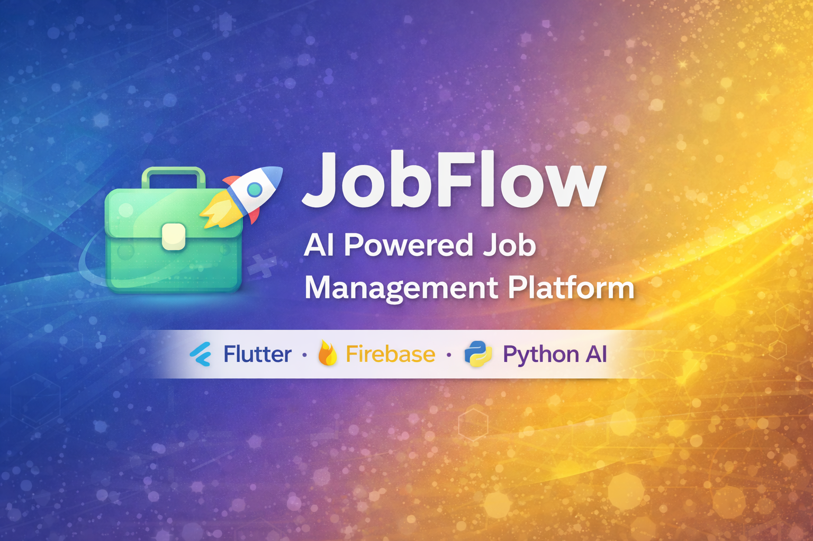

# 🚀 JobFlow — AI Powered Job Management Platform

<p align="center">
  
</p>

<p align="center">
  <b>Smart Recruitment • AI Resume Matching • Real-Time Hiring Workflow</b>
</p>

<p align="center">
  
  
  
  
</p>

---

## 📌 Overview

**JobFlow** is an AI-powered recruitment and job management platform built using **Flutter** and **Firebase**.

The system connects:

* 👨‍💼 Job Seekers
* 🏢 Companies
* 🛡️ Administrators

inside a unified hiring ecosystem.

It automates recruitment workflows including job posting, candidate tracking, resume processing, and intelligent matching.

---

## ✨ Key Features

### 👤 Job Seeker Module

* Secure Authentication
* Job Search & Filtering
* One-Click Job Application
* Resume Upload
* Application Tracking
* Notifications & Updates

---

### 🏢 Company Module

* Post & Manage Jobs
* Applicant Management
* Candidate Profile Viewing
* Resume Matching System
* Hiring Status Control

---

### 🛡️ Admin Dashboard

* Platform Monitoring
* User Management
* Company Supervision
* Analytics & Reports
* System Control Panel

---

## 🤖 AI Integration

JobFlow integrates Python-based AI modules for:

* Resume Parsing
* Skill Extraction
* Resume–Job Matching
* Candidate Ranking

```
Flutter App → Firebase → Python AI Server → Matching Results
```

---

## 🏗️ Project Architecture

```
lib/
│
├── Authentication/
├── UserSide/
├── CompanySide/
├── Admin_Side/
├── WelcomePages/
├── Widgets/
├── services/
├── firebasenotifications/
├── Python/
│
└── main.dart
```

---

## 🛠️ Tech Stack

### Frontend

* Flutter
* Dart
* Material UI

### Backend

* Firebase Authentication
* Cloud Firestore
* Firebase Storage
* Firebase Cloud Messaging

### AI & Processing

* Python
* Resume Matcher Engine
* REST API Integration

### Additional Tools

* Google Sign-In
* Local Notifications
* PDF Generation
* Charts & Analytics
* Image & File Picker

---

## 📱 Application Screenshots

| Home Screen                 | Job Listings                | Company Dashboard              |
| --------------------------- | --------------------------- | ------------------------------ |
|  |  |  |

> Add your screenshots inside **assets/images/**

---

## 🚀 Installation Guide

### 1️⃣ Clone Repository

```bash
git clone https://github.com/diya2405/JobFlow.git
cd JobFlow
```

### 2️⃣ Install Dependencies

```bash
flutter pub get
```

### 3️⃣ Firebase Setup

* Create Firebase Project
* Enable Authentication
* Enable Firestore Database
* Enable Storage
* Enable Cloud Messaging
* Add configuration files:

```
android/app/google-services.json
ios/Runner/GoogleService-Info.plist
```

⚠️ Never upload service-account credentials.

---

### 4️⃣ Run Project

```bash
flutter run
```

---

## 🔮 Future Enhancements

* ✅ AI Job Recommendation
* ✅ Resume Skill Scoring
* ✅ Interview Scheduling
* ✅ Admin Analytics Dashboard
* ✅ Web Version
* ✅ ML-Based Hiring Prediction

---

## 📄 Project Documentation

Detailed project documentation and system explanation:

📘 **Project Report**  
➡️ [View Report](ProjectReports/JOBFLOW_Project_Report.pdf)

📊 **Project Presentation**  
➡️ [View PPT](ProjectReports/JobFlow_Presentation.pptx)

The documentation includes:
- System Architecture
- Database Design
- Workflow Diagrams
- Feature Explanation
- Implementation Details
## 👩‍💻 Developer

**Diya Shah**
2nd year IT Student

📧 [diyanamya@gmail.com](mailto:diyanamya@gmail.com)
🔗 GitHub: https://github.com/diya2405
🔗 LinkedIn: https://www.linkedin.com/in/diya-shah-85ba49308/

---

## ⭐ Support

If you like this project:

⭐ Star the repository
🍴 Fork it
🚀 Contribute

---

<p align="center">
Made with ❤️ using Flutter & Firebase
</p>


